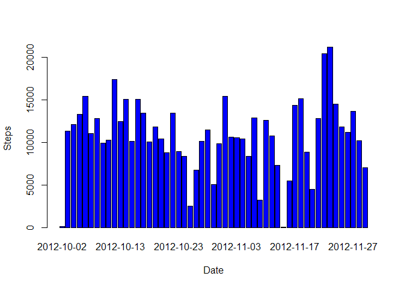
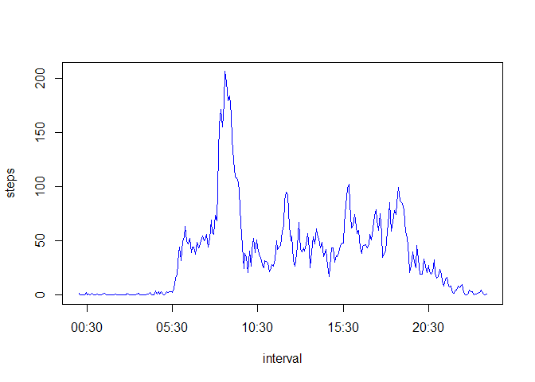
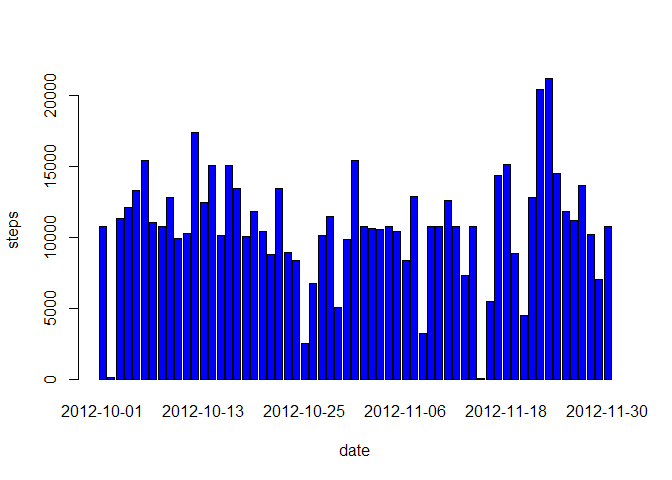
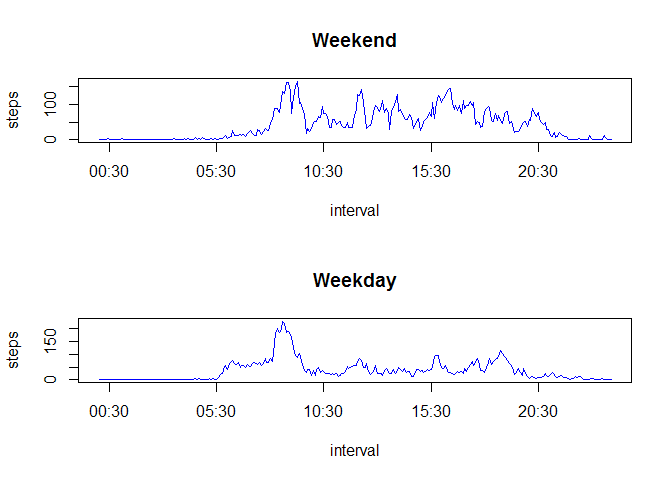

# Reproducible Research: Peer Assessment 1


## Loading and preprocessing the data


```r
unzip("activity.zip")
mydata <- read.csv("activity.csv")

library(stringr)
mydata$interval = str_pad(mydata$interval, width=4, pad="0")
mydata$interval <- as.POSIXct(mydata$interval, format = "%H%M")
```

## What is mean total number of steps taken per day?

## 1. Histogram of the total number of steps taken each day


```r
totalsteps <- aggregate(steps ~ date, data = mydata, FUN = sum)
barplot(totalsteps$steps, names.arg = totalsteps$date, xlab = "Date", ylab = "Steps" ,col = "blue")
```

 

## 2. The Mean and Median total number of steps taken per day


```r
mean(totalsteps$steps)
```

```
## [1] 10766
```

```r
median(totalsteps$steps)
```

```
## [1] 10765
```

## What is the average daily activity pattern?

## 1. Time series plot (i.e. type = "l") of the 5-minute interval (x-axis) and the average number of steps taken, averaged across all days (y-axis)


```r
stepsinterval <- aggregate(steps ~ interval, data = mydata, FUN = mean)
plot(stepsinterval, type = "l" ,col = "blue")
```

 


## 2. 5-minute interval, on average across all the days in the dataset,contains the maximum number of steps


```r
stepsinterval$interval[which.max(stepsinterval$steps)]
```

```
## [1] "2014-10-17 08:35:00 IST"
```

## Imputing missing values

## 1. Total number of missing values in the dataset (i.e. the total number of rows with NAs)


```r
sum(is.na(mydata))
```

```
## [1] 2304
```

## Filling missing values


```r
mydata <- merge(mydata, stepsinterval, by = "interval", suffixes = c("", ".y"))
nas <- is.na(mydata$steps)
mydata$steps[nas] <- mydata$steps.y[nas]
mydata <- mydata[, c(1:3)]
```

## Histogram


```r
stepsdate <- aggregate(steps ~ date, data = mydata, FUN = sum)
barplot(stepsdate$steps, names.arg = stepsdate$date, xlab = "date", ylab = "steps" ,col = "blue")
```

 

## The mean and median total number of steps taken per day


```r
mean(totalsteps$steps)
```

```
## [1] 10766
```

```r
median(totalsteps$steps)
```

```
## [1] 10765
```

## Differences in activity patterns between weekdays and weekends


```r
daytype <- function(date) {
        if (weekdays(as.Date(date)) %in% c("Saturday", "Sunday")) {
                "Weekend"
        } else {
                "Weekday"
        }
}
mydata$daytype <- as.factor(sapply(mydata$date, daytype))

par(mfrow = c(2, 1))
for (type in c("Weekend", "Weekday")) {
        steps.type <- aggregate(steps ~ interval, data = mydata, subset = mydata$daytype == 
                                        type, FUN = mean)
        plot(steps.type, type = "l", main = type,col = "blue")
}
```

 
